# 🥦 IA Nutricionista

Bem-vindo ao **IA Nutricionista**, uma plataforma avançada que une o poder da **inteligência artificial** com a **ciência da nutrição** para oferecer orientações alimentares verdadeiramente personalizadas. Nosso agente virtual, o **"Nutrólogo Supremo"**, é uma figura icônica no mundo da nutrição, reconhecido por sua expertise global e capacidade de fornecer conselhos adaptados às necessidades individuais de cada usuário.

O **IA Nutricionista** não é apenas um chatbot; é um **"consultor nutricional"** virtual que utiliza conhecimentos aprofundados em **bioquímica**, **metabolismo** e diversas abordagens dietéticas, como a dieta **mediterrânea**, **cetogênica** e **ayurvédica**. Com foco na sustentabilidade alimentar e no consumo consciente, nosso agente está comprometido em ajudá-lo a alcançar saúde otimizada e bem-estar integral. 🌱

## ⚠️ Aviso Importante

O **IA Nutricionista** é uma ferramenta informativa e educacional que tem como objetivo auxiliar os usuários em suas escolhas alimentares e estilo de vida. **Este projeto não substitui a consulta, diagnóstico ou tratamento realizado por profissionais de saúde qualificados**. As orientações fornecidas pelo agente virtual não devem ser utilizadas como substituto para aconselhamento médico ou nutricional profissional.

Recomendamos fortemente que você consulte um médico, nutricionista ou outro profissional de saúde certificado para obter orientações personalizadas e adequadas às suas necessidades individuais. O uso das informações fornecidas pelo **IA Nutricionista** é de sua própria responsabilidade.

_Projeto desenvolvido com ❤️ pela equipe da asmimov.academy._

## 🏛️ Arquitetura

```mermaid
graph TD
    subgraph Telegram
        A[Usuário] -- Mensagem/Imagem --> B[Bot do Telegram]
        B -- Resposta --> A
    end

    B -- Chamada --> C[Agente Nutricionista]

    subgraph Backend
        C -- Consulta --> D[Gerenciador de Memória]
        D -- Armazena --> F["SQLite (Memória de Chat)"]
        C -- Utiliza --> E[Tools]
        E -- Acessa --> G["TinyDB (Banco de Dados Principal)"]
    end
    C -- Utiliza --> H[OpenAI API]
    E -- Processa --> I["Modelos de Visão"]
```



### Descrição da Arquitetura Atualizada

**Usuário**: Interage com o sistema enviando mensagens de texto ou imagens através do **Telegram**. O usuário pode solicitar orientações nutricionais, enviar fotos de refeições, registrar peso, entre outras ações.

**Bot do Telegram**: Atua como intermediário entre o usuário e o sistema. Recebe as mensagens ou imagens enviadas pelo usuário e as encaminha para o **NutritionistAgent**. Após o processamento, envia as respostas geradas pelo agente de volta ao usuário, mantendo uma comunicação fluida.

**Agente Nutricionista**: É o componente central responsável por processar as entradas dos usuários. Mantém o contexto da conversa, permitindo interações mais naturais e personalizadas. Decide quando e quais **ferramentas (Tools)** utilizar para executar ações específicas solicitadas pelo usuário.

**Gerenciador de Memória**: Responsável por armazenar e gerenciar o histórico das conversas entre o usuário e o agente. Utiliza o **SQLite** como banco de dados para a memória do chat, garantindo que o agente possa acessar conversas anteriores e manter o contexto em interações futuras.

**Tools (Ferramentas)**: Conjunto de módulos que expandem as capacidades do agente, permitindo a execução de tarefas especializadas. Cada ferramenta desempenha uma função específica:

- **UserRegistrationTool**:
  - **Função**: Registra novos usuários ou atualiza as informações de usuários existentes.
  - **Descrição**: Solicita e armazena dados como nome, sexo, idade, altura, peso, condições de saúde (por exemplo, diabetes) e objetivos nutricionais (como perder peso ou ganhar massa muscular).

- **DietPlanTool**:
  - **Função**: Cria ou recupera planos de dieta personalizados para o usuário.
  - **Descrição**: Com base nas informações fornecidas pelo usuário, gera planos alimentares adaptados às suas necessidades e objetivos. Pode salvar planos aprovados pelo usuário no banco de dados para referência futura.

- **FoodImageAnalyzerTool**:
  - **Função**: Analisa imagens de pratos de comida enviadas pelo usuário.
  - **Descrição**: Utiliza o modelo de captioning **BLIP** para gerar descrições das imagens localmente. Em seguida, emprega a **OpenAI API** para estimar informações nutricionais e criar uma tabela nutricional da refeição.

- **MealEntryTool**:
  - **Função**: Registra refeições consumidas pelo usuário, armazenando detalhes nutricionais.
  - **Descrição**: Coleta informações sobre as refeições, como descrição dos alimentos, calorias, carboidratos, proteínas e gorduras. Se alguma informação estiver faltando, interage com o usuário para obtê-la antes de registrar no banco de dados.

- **ReminderTool**:
  - **Função**: Agenda lembretes personalizados para o usuário.
  - **Descrição**: Permite que o usuário configure lembretes para ações como horários de refeições, ingestão de água, suplementações ou exercícios. Os lembretes podem ser únicos ou recorrentes, e o sistema envia notificações nos horários agendados.

- **ReportTool**:
  - **Função**: Gera relatórios detalhados sobre o progresso do usuário.
  - **Descrição**: Compila e analisa dados coletados, como registros de peso, refeições consumidas e cumprimento de metas. Fornece insights semanais ou mensais, ajudando o usuário a acompanhar seu desempenho e ajustar seu plano conforme necessário.

- **WeightUpdateTool**:
  - **Função**: Registra e monitora o peso do usuário ao longo do tempo.
  - **Descrição**: Armazena registros de peso com data e hora, permitindo que o agente identifique tendências, calcule variações e ofereça feedback personalizado sobre o progresso em relação aos objetivos estabelecidos.

**TinyDB (Banco de Dados Principal)**: Banco de dados NoSQL utilizado pelas **Tools** para armazenar e recuperar informações essenciais. Contém dados dos usuários, registros de refeições, planos de dieta, lembretes, relatórios e outros elementos críticos para o funcionamento personalizado do sistema.

**OpenAI API**: Serviço que fornece modelos de linguagem avançados utilizados tanto pelo **Agente Nutricionista** quanto pelas **Tools**. É fundamental para o processamento de linguagem natural, permitindo que o agente compreenda as solicitações dos usuários e gere respostas contextuais e coerentes.

**Modelos de visão**: Tecnologia empregada pelo **FoodImageAnalyzerTool** para processar imagens. O modelo de visão gera descrições detalhadas das imagens de pratos de comida enviadas pelos usuários, servindo como base para a análise nutricional subsequente realizada pelo agente.

### Arquitetura do Banco de Dados

[Leia mais detalhes aqui](docs/database_diagram.md)

## 🛠️ Tecnologias Utilizadas

- **Python 3.12+**: Linguagem principal do projeto.
- **LangChain**: Framework para construção de agentes conversacionais.
- **OpenAI API**: Fornece os modelos de linguagem como o `gpt-4o-mini`.
- **TinyDB**: Banco de dados NoSQL em formato JSON para persistência de dados.
- **Pyrogram**: Biblioteca para interação com a API do Telegram.
- **Docker**: Para containerização e fácil implantação da aplicação.

## ✨ Features

- **Conversação Natural**: O agente pode manter diálogos contextuais, lembrando-se de interações anteriores.
- **Análise de Imagens**: Envie uma foto de um prato de comida e receba uma tabela nutricional estimada.
- **Registro de Peso**: Registre seu peso regularmente; o agente armazenará essas informações para analisar seu progresso ao longo do tempo.
- **Registro de Alimentações**: Mantenha um diário alimentar registrando suas refeições, permitindo um acompanhamento detalhado da sua dieta.
- **Lembretes Personalizados**: Configure lembretes para receber notificações do agente nos horários das suas refeições ou suplementações.
- **Relatórios Semanais**: Receba um relatório semanal detalhado sobre seu desempenho, incluindo análises da sua alimentação, ingestão nutricional e progresso em direção aos seus objetivos.
- **Orientação Personalizada**: Respostas e conselhos adaptados aos seus objetivos e preferências individuais.
- **Memória Persistente**: Histórico de conversas e dados armazenados para futuras interações e análises.


## ⚙️ Pré-requisitos

- **Python 3.12+** instalado.
- **Docker** instalado (opcional, se optar por executar com Docker).
- **Chave de API da OpenAI**.
- **Credenciais de API do Telegram** (API ID, API Hash e Bot Token).


## 🚀 Instalação e Execução

### 🐳 Com Docker

1. **Clone o repositório:**

   ```bash
   git clone https://github.com/seu-usuario/ia-nutricionista.git
   cd ia-nutricionista
   ```

2. **Configure as variáveis de ambiente:**

   Crie um arquivo `.env` na raiz do projeto com as seguintes informações:

   ```env
   OPENAI_API_KEY=your_openai_api_key
   TELEGRAM_API_ID=your_telegram_api_id
   TELEGRAM_API_HASH=your_telegram_api_hash
   TELEGRAM_TOKEN=your_telegram_bot_token
   TELEGRAM_BOT_NAME=your_telegram_bot_name
   ```

3. **Execute o script:**

   ```bash
   ./bin/build.sh
   ```

   > 📁 As imagens enviadas pelos usuários via telegram serão armazenadas na pasta `storage`.

### 💻 Sem Docker

1. **Clone o repositório:**

   ```bash
   git clone https://github.com/seu-usuario/ia-nutricionista.git

   cd ia-nutricionista
   ```

2. **Crie e ative um ambiente virtual:**

   ```bash
   python3 -m venv venv # No Linux
   ```

   ```bash
   source venv/bin/activate  # No Windows
   ```

3. **Instale as dependências:**

   ```bash
   pip install -r requirements.txt
   ```

4. **Configure as variáveis de ambiente:**

   Crie um arquivo `.env` na raiz do projeto com as seguintes informações:

   ```env
   OPENAI_API_KEY=your_openai_api_key
   TELEGRAM_API_ID=your_telegram_api_id
   TELEGRAM_API_HASH=your_telegram_api_hash
   TELEGRAM_TOKEN=your_telegram_bot_token
   TELEGRAM_BOT_NAME=your_telegram_bot_name
   ```

5. **Execute a aplicação:**

   ```bash
   python nutritionist/app.py
   ```

## 📚 Extras

- **Armazenamento de Imagens**: As imagens enviadas pelos usuários serão salvas na pasta `storage` na raiz do projeto.
- **Requisitos Adicionais**: Certifique-se de que as variaveis de ambiente sejam inseridas no seu `.env` assim como está no `.env-example` 